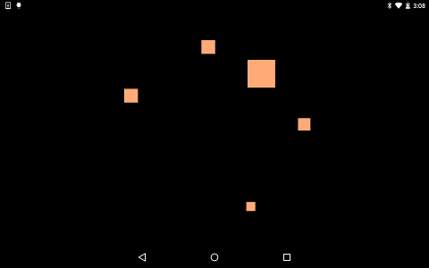

# Dart:UI Touch Event

https://github.com/kyorohiro/hello_skyengine/tree/master/dartui_event



```
import 'dart:ui' as ui;
import 'package:vector_math/vector_math_64.dart';

// ex 3:4 game screen
double stageWidth = 800.0;
double stageHeight =  600.0;
ui.Rect stageSize = new ui.Rect.fromLTWH(0.0, 0.0, stageWidth, stageHeight);

//
//
double widthPaddingless = 0.0;
double heightPaddingless = 0.0;
double stageRatio = 0.0;
double stageTop = ui.view.paddingTop;
double stageLeft = ui.view.paddingLeft + (widthPaddingless - stageWidth * stageRatio) / 2.0;

//
//
Map<int, PointerInfo> pointerInfos = {};

void onPaint(double timeStamp) {
  ui.PictureRecorder recorder = new ui.PictureRecorder();
  ui.Canvas canvas = new ui.Canvas(recorder, stageSize);

  //
  for (PointerInfo i in pointerInfos.values) {
    ui.Paint paint = new ui.Paint();
    paint.color = new ui.Color.fromARGB(0xff, 0xff, 0xaa, 0x77);
    double size = i.pressure*100;
    ui.Rect drawRectSize = new ui.Rect.fromLTWH(
        i.x-size/2.0,
        i.y-size/2.0,
        size,
        size);
    canvas.drawRect(drawRectSize, paint);
  }
  ui.Picture picture = recorder.endRecording();
  ui.view.scene = createScene(picture);
}

void onEvent(ui.Event event) {
  if (event is ui.PointerEvent) {
    onPointerEvent(event);
  }
  if (event is ui.KeyboardEvent) {
    onKeyboardEvent(event);
  }
  if (event is ui.WheelEvent) {
    onWheelEvent(event);
  }
  ui.view.scheduleFrame();
}

void onPointerEvent(ui.PointerEvent event) {
  print("---pointer:${event.x} ${event.dx}");
  if (!pointerInfos.containsKey(event.pointer)) {
    pointerInfos[event.pointer] = new PointerInfo()
      ..x = event.x-stageLeft
      ..y = event.y-stageTop;
  }

  pointerInfos[event.pointer].x = (event.x/stageRatio)-stageLeft;
  pointerInfos[event.pointer].y = (event.y/stageRatio)-stageTop;
  pointerInfos[event.pointer].pressure = event.pressure / event.pressureMax;

  switch(event.type) {
    case "pointerup":
      pointerInfos.remove(event.pointer);
    break;
    case "pointercancel":
      pointerInfos.clear();
    break;
  }
}

void onKeyboardEvent(ui.KeyboardEvent event) {}

void onWheelEvent(ui.WheelEvent event) {}

void main() {
  update();
  ui.view.setFrameCallback(onPaint);
  ui.view.setMetricsChangedCallback(() {
    update();
    ui.view.scheduleFrame();
  });
  ui.view.setEventCallback(onEvent);
  ui.view.scheduleFrame();
}

class PointerInfo {
  double x = 0.0;
  double y = 0.0;
  double pressure = 0.0;
}


void update() {
  widthPaddingless = ui.view.width - ui.view.paddingLeft - ui.view.paddingRight;
  heightPaddingless = ui.view.height - ui.view.paddingTop - ui.view.paddingBottom;
  double rw = widthPaddingless / stageWidth;
  double rh = heightPaddingless / stageHeight;
  stageRatio = (rw < rh ? rw : rh);
  stageTop = ui.view.paddingTop;
  stageLeft = ui.view.paddingLeft + (widthPaddingless - stageWidth * stageRatio) / 2.0;
}

ui.Scene createScene(ui.Picture picture) {
  ui.Rect sceneBounds = new ui.Rect.fromLTWH(
      0.0,
      0.0,
      ui.view.width * ui.view.devicePixelRatio,
      ui.view.height * ui.view.devicePixelRatio);

  Matrix4 mat = new Matrix4.identity();
  mat.translate(stageLeft * ui.view.devicePixelRatio, stageTop * ui.view.devicePixelRatio);
  mat.scale(stageRatio * ui.view.devicePixelRatio,
      stageRatio * ui.view.devicePixelRatio, 1.0);

  ui.SceneBuilder sceneBuilder = new ui.SceneBuilder(sceneBounds);
  sceneBuilder.pushTransform(mat.storage);
  sceneBuilder.pushClipRect(stageSize);
  sceneBuilder.addPicture(ui.Offset.zero, picture, stageSize);
  sceneBuilder.pop();
  sceneBuilder.pop();
  return sceneBuilder.build();
}

```
