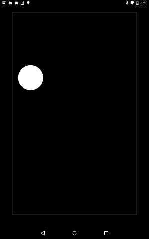

# Gravity Sensor demo

https://github.com/kyorohiro/hello_skyengine/tree/master/mojo_sensor_demo




```
//
// following code is checked in 2016/01/13
//
import 'package:flutter/services.dart';
import 'package:mojo_services/sensors/sensors.mojom.dart';
import 'package:flutter/widgets.dart';
import 'package:flutter/rendering.dart';
import 'package:flutter/scheduler.dart';

import 'dart:ui' as sky;

//
double worldDx = 0.0;
double worldDy = 0.0;
double worldDz = 0.0;

main() async {
  print("######====================####s##");
  SensorServiceProxy sensor = new SensorServiceProxy.unbound();
  shell.connectToService("h", sensor);

  SensorListenerStub stub = new SensorListenerStub.unbound();
  stub.impl = new MySensorListener();
  sensor.ptr.addListener(SensorType.GRAVITY, stub);
  print("######====================###s###");

  runApp(new DrawRectWidget());
}

class MySensorListener extends SensorListener {
  void onAccuracyChanged(int accuracy) {
    print("accuracy: ${accuracy}");
  }

  void onSensorChanged(SensorData data) {
    print("data: ${data.accuracy} ${data.values}");
    worldDx = data.values[0];
    worldDy = data.values[1];
    worldDz = data.values[2];
  }
}
class DrawRectWidget extends OneChildRenderObjectWidget {
  RenderObject createRenderObject() {
    return new DrawRectObject();
  }
}

class DrawRectObject extends RenderBox {
  double s = 100.0;
  double x = 100.0;
  double y = 100.0;
  double dx = 0.0;
  double dy = 0.0;

  @override
  void performLayout() {
    size = constraints.biggest;
    Scheduler.instance.addFrameCallback(onTick);
  }

  @override
  void paint(PaintingContext context, Offset offset) {
    Paint p = new Paint();
    p.color = new Color.fromARGB(0xff, 0xff, 0xff, 0xff);
    Rect r = new Rect.fromLTWH(x - s/2.0, y - s/2.0, s, s);
    context.canvas.drawOval(r, p);
    p.style = sky.PaintingStyle.stroke;
    Rect w = new Rect.fromLTWH(s/2, s/2, this.paintBounds.width-s, this.paintBounds.height-s);
    context.canvas.drawRect(w, p);
  }

  onTick(Duration timeStamp) {
    Scheduler.instance.addFrameCallback(onTick);
    x += dx;
    y += dy;
    if(y-s < paintBounds.top) {
      y = paintBounds.top+s;
      dy = -0.8*dy;
    }
    if(y+s > paintBounds.bottom) {
      y = paintBounds.bottom-s;
      dy = -0.8*dy;
    }
    if(x-s < paintBounds.left) {
      x = paintBounds.left+s;
      dx = -0.8*dx;
    }
    if(x+s > paintBounds.right) {
      x = paintBounds.right-s;
      dx = -0.8*dx;
    }
    dx += -1*worldDx/3.0;
    dy += worldDy/3.0;
    markNeedsPaint();
  }
}

```
