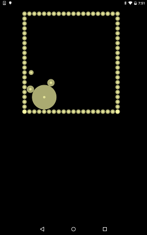

# Collision without rotation
2D physics test

https://github.com/kyorohiro/hello_skyengine/tree/master/ph_2d_boun_no_rot



```
part of tinyphysics2d;

class Primitive {
  Vector3 xy = new Vector3.zero();
  Vector3 dxy = new Vector3(0.0, 0.0, 0.0);
  double mass = 1.0;
  bool isFixing = false;
  double elastic = 0.6;
  double angle = 0.0;
  double dangle = 0.0;

  bool checkCollision(Primitive p) {
    return false;
  }

  void move(double dx, double dy) {
    if (isFixing == false) {
      xy.x += dx;
      xy.y += dy;
    }
  }

  void next(double t) {}

  void collision(Primitive p) {}
}

class CirclePrimitive extends Primitive {
  double radius = 10.0;

  void next(double t) {
    move(dxy.x * t, dxy.y * t);
  }

  void move(double dx, double dy) {
    if (isFixing == false) {
      xy.x += dx;
      xy.y += dy;
    }
  }

  bool checkCollision(Primitive p) {
    CirclePrimitive c = p;
    double distance = calcXYDistance(p);
    double boundary = this.radius + c.radius;
    if (boundary > distance) {
      return true;
    } else {
      return false;
    }
  }

  double calcXYDistance(Primitive p) {
    double dX = math.pow(p.xy.x - this.xy.x, 2);
    double dY = math.pow(p.xy.y - this.xy.y, 2);
    double distance = math.sqrt(dX + dY);
    return distance;
  }

  Vector3 calcXYDistanceDirection(Primitive p) {
    Vector3 vv = p.xy - this.xy;
    return vv.normalize();
  }

  void collision(Primitive p) {
    if (this.isFixing == true) {
      this.dxy.x = 0.0;
      this.dxy.y = 0.0;
    }
    if (p is CirclePrimitive) {
      CirclePrimitive c = p;
      double distance = calcXYDistance(p);
      double boundary = this.radius + c.radius;
      Vector3 distanceDirection = calcXYDistanceDirection(p);
      Vector3 collisionDirection = calcXYDistanceDirection(p);
      Vector3 relativeSpeed = p.dxy - this.dxy;

      // e is 0-1
      // J = -(v1p- v2p) * (e+1) / (1/m1 + 1/m2)
      double bounce = 1.0;
      double j1 = -1.0 * (1.0 + bounce) * (relativeSpeed.dot(collisionDirection));
      double j2 = (1.0 / p.mass + 1.0 / this.mass);
      double j = j1 / j2;

      Vector3 p_dv = (collisionDirection * j) / p.mass;
      Vector3 t_dv = (collisionDirection * -1.0 * j) / this.mass;

      if (this.isFixing == false) {
        this.dxy += t_dv;
      }
      if (p.isFixing == false) {
        p.xy += distanceDirection * (boundary - distance + 0.1) / 1.0;
        p.dxy += p_dv;
      }
    }
  }
}
```


```
class World {
  Vector3 gravity = new Vector3(0.0, -9.8 / 500.0, 0.0);
  List<Primitive> primitives = [];
  next(double time) {
    for (Primitive a in primitives) {
      for (Primitive b in primitives) {
        if (a != b && a.checkCollision(b)) {
          a.collision(b);
        }
      }
      if (a.isFixing == false) {
        a.dxy.x += gravity.x;
        a.dxy.y += gravity.y;
      }
      a.next(time);
    }
  }
}

```
